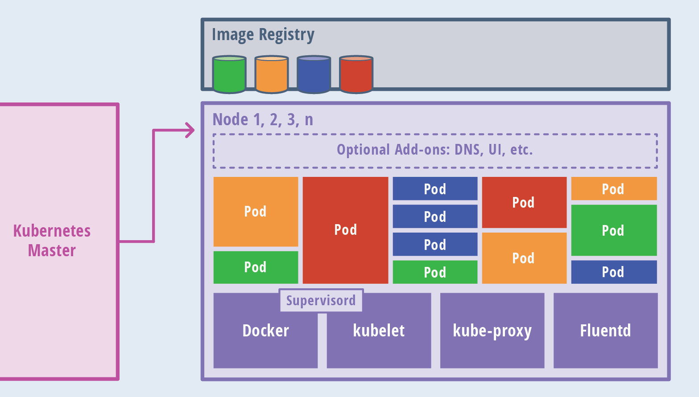
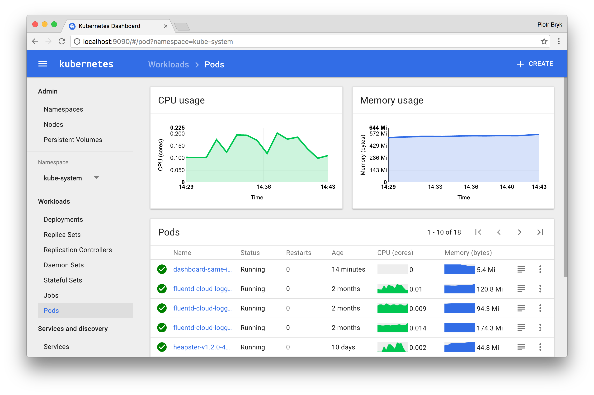

autoscale: true


---

# About me

- George Crawford
- Engineer at OVO Energy in Bristol
- Senior Developer at the Financial Times
- Developer at Assanka, later FT Labs
- Freelance classical musician and Wordpress wrangler

[.footer: [OVO Energy jobs](https://www.ovoenergy.com/careers/vacancies)  •  [FT.com](https://www.ft.com/)  •  [FT web app](https://app.ft.com/)  •  [FT Labs](https://labs.ft.com/)]
[.build-lists: true]

---

# Before we start

^
- hands up if you write JavaScript for your job
- keep them up if you write server-side applications in Node.js
- keep them up if you've ever done any 'ops' or dev-ops': CI or server configuration, etc.
- keep them up if you have been known to FTP files onto a server
- keep them up if you have ever live-edited a file on a server in production
- Who's ever used Docker?
- Who's ever used Heroku?
- who's ever used kubernetes?

---

# Before we start

^ 
- talk is: "An introduction to Docker and Kubernetes for Node.js developers"
- but I'm a developer
- not a deep dive where you'll learn everything
- a more personal story of how my relationship with servers has changed over the years

---

# Servers and me

---

# Servers and me
### A story in five parts:

- **Part 1**: FTP & mounted drives
- **Part 2**: Sandboxes, Puppet, Jenkins, scary 'prod'
- **Part 3**: Virtual Machines & Vagrant
- **Part 4**: Containerisation
- **Part 5**: Orchestration


---

# Servers and me
## Part 1: FTP & mounted drives

^ 
- FTP code onto a server. Wordpress, etc.
- I discovered rsync and mounted SFTP drives, so could work 'on the server'

---

# Servers and me
## Part 2: Sandboxes, Puppet, Jenkins, scary 'prod'

^ 
- First real job
- Suite of servers
- herbs and spices: Tarragon, Ginger
- fond memory: Turmeric was upgraded to Saffron
- in a datacentre which we sometimes needed to drive to to install a new rack box

---

# Servers and me
## Part 2: Sandboxes, Puppet, Jenkins, scary 'prod'

^ 
- Server configuration was managed by Puppet
- code was deployed via rsync by Jenkins CI jobs
- production was terrifying
- had to keep it up at all costs
- although Puppet helps keep servers up-to-date, it doesn't give a verifiable environment
- occasionally live-edited code on prod, which 'sometimes' made it back into our version control

---

# Servers and me
## Part 2: Sandboxes, Puppet, Jenkins, scary 'prod'

^ 
- for local dev: a 'sandbox' server
- hosted in a server room a few meters from our desks to be fast
- everyone on the team had a different way of getting code onto the server: 
	- some SSH'd in and used Vim
	- some mounted the drive and worked locally, with hiccoughs
	- some developed complicated 2-way rsync solutions (mention Kornel?)

---

# Servers and me
## Part 3: Virtual Machines & Vagrant

^ 
- We then migrated to a Vagrant setup
- a full virtual machine on our laptops with the services we needed
- mounting folders into it from the host
- running same servers on Mac, Windows and Linux

---

# Servers and me
## Part 3: Virtual Machines & Vagrant

^ 
- not a bad workflow
- still loads of compromises: 
1. simplified versions of things for local dev
2. everything in the same VM rather than isolated as it would be in prod
3. all localhost networking
4. no load balancing

---

# Servers and me
## Part 3: Virtual Machines & Vagrant

^ 
- Most worryingly:
- dev, ci and prod could easily get out of sync
- we had no easy way to verify new versions of software
- Even with Puppet, how can you be sure that everything on the server has been documented?

---

> "Cattle, not pets"

^ who's heard of this term?

---

# Pets
- indispensable or unique systems that can never be down
- manually built, managed, and 'hand fed'
- need to be rebuilt if the server gets corrupted or suffers hardware failure

[.build-lists: true]

---

# Cattle
- Arrays of more than two servers
- built using automated tools
- designed for failures
- no one server is irreplaceable
- during failure events, no human intervention is required
- the cluster routes around failures by load-balancing and restarting new servers
- think...*abattoir*

[.build-lists: true]

---

# Servers and me
## Part 4: Containerisation

^ 
- what's wrong with the process I've described?
- the longer a server lives, the more likely you are to treat it like a pet
- servers are nurtured, but the changes don't make it back into version control
- dev, ci, staging and production are architected differently

---

> The way I think about it: every difference between dev/staging/prod will eventually result in an outage

[.footer: Joe Beda: [https://twitter.com/jbeda/status/921185541487341568](https://twitter.com/jbeda/status/921185541487341568)]

---

# Virtualisation

 

[.footer: https://www.quora.com/What-is-the-difference-between-Docker-and-Vagrant-When-should-you-use-each-one]

^ 
- Vagrant uses virtualization
- each virtual machine runs its own entire operating system inside a simulated hardware environment

---

# Containerisation


[.footer: https://www.quora.com/What-is-the-difference-between-Docker-and-Vagrant-When-should-you-use-each-one]

^ 
- Docker uses containerization
- allows multiple applications to run in isolated partitions of the kernel directly on the physical hardware

---

### Benefits of containerisation

- isolated
- encapsulated
- declarative
- versioned
- standardised
- repeatable
- portable
- verifiable
- simple for developers

[.build-lists: true]

^ 
- let's take a look at how we can improve confidence 
- be sure that that the process you run locally in development behaves the same as in production
- similar to the goals for good software design in general

---

## Docker 

^
- Docker is a way to package code into consistent units of work
- the units can then be deployed to testing, QA and production environments
- Docker needs to only to express the configuration for a single process
- so unlike Puppet, Chef, etc., which need to manage a whole virtual machine
- the problem becomes far easier


---

### Docker: introduction

```docker
FROM [IMAGE]
```

^ Most docker commands relate to an image. An image is built from a manifest file, called a 'Dockerfile'. You're building up a bundle of resources which can run a single process

[.footer: /Dockerfile]


---

### Docker: image registry


[.footer: [https://hub.docker.com/_/node/](https://hub.docker.com/_/node/) ]

^ Docker images inherit from other images - eventually down to a base image. For node, there are many varieties of tag on the 'Docker Hub' registry:

---

### Docker: introduction

```docker
FROM node:8
```

^ each line in the file is an instruction (inherit from another image, add files, run commands, set permissions, etc.)

[.footer: /Dockerfile]

---

### Docker: commands

```bash, [.highlight: 1-4]
# Build an image from the Dockerfile
docker build .
... 
Successfully built badd967af535

# Run the image as a container, in an interactive terminal
$ docker run --rm -it badd967af535
```

^ First we'll build an image from our manifest
**demo: build**

---

### Docker: commands

```bash, [.highlight: 6-7]
# Build an image from the Dockerfile
docker build .
... 
Successfully built badd967af535

# Run the image as a container, in an interactive terminal
$ docker run --rm -it badd967af535
```

^ Building an image gives us a checksum. We can make a container out of an image using `docker run`, and we have a Node 8 container.
**demo: run**

---

### Docker: Image variants
| | | 
| :--- | :--- | 
| **node:8** | de facto, based on common `buildpack-deps` image (Debian 'jessie') | 
| **node:8-alpine** | lightweight, much smaller images, great for CI and deployment | 

---

### Docker: Tags and updates
|  |  |
| :--- | :--- |
| :**8.7.0** | fixed at 8.7.0 |
| :**8.7** | < 8.8.0 |
| :**8** | < 9.0.0 |
| :**latest** | ∞ |


---

### Docker: the Dockerfile

| | |
--- | --- 
**FROM** | define the base image used to start the build process
**WORKDIR** | set the path where commands are executed, and files are copied to
**ENV** | set environment variables
**ADD** | add files from a source on the host to the container’s own filesystem
**CMD** | set the default command to run when the container starts
**ENTRYPOINT** | set the default application to be used when the container starts
**EXPOSE** | expose a port to the outside world
**RUN** | execute a script or command (e.g. bash)
**USER** | set the UID (username) that will run the container
**VOLUME** | enable access from the container to a directory on the host machine

---

### Docker: image layers

```docker
FROM node:8

RUN echo 'hello world!'
```

[.footer: `/Dockerfile`]

^ each instruction in the Dockerfile creates a new layer, with a checksum to verify its integrity
**demo: build, new layer**

^ first layer is cached

---

### Docker: layer caching

Chain commands which belong together:
<br>

```docker
RUN apt-get update && apt-get install -y \
  bzr \
  cvs \
  git \
  mercurial \
  subversion
```

^ 
- each line creates a cached image layer
- you will often see multiple commands chained together: ensures dependencies are all cached in a single layer

---

### Docker: layer caching

Use `ENV` variables to bust the cache:
<br>

```docker
ENV PACKAGE_VERSION 8.7.0

RUN apt-get update && apt-get install -y \
        package-bar \
        package-baz \
        package-foo=$PACKAGE_VERSION
```


^ 
- So how can you even upgrade a package when it's always cached? 
- Bust the cache in an earlier layer with environment variables

---

###Docker: Simple example

```js
const express = require('express');

const PORT = 8080;
const HOST = '0.0.0.0';

const app = express();
app.get('*', (req, res) => {
	console.log(`Handling request to ${req.path}`);
	res.send('Hello world\n');
});

app.listen(PORT, HOST, () => {
	console.log(`Running on http://${HOST}:${PORT}`);
});
```
[.footer: `/index.js`]

---

###Docker: Simple example

#### caching: the wrong way!

```docker
FROM node:8-alpine

EXPOSE 8080

WORKDIR /app

COPY . .

# This will run when any source file changes, even if package.json didn't change
RUN npm install

CMD ["node", "index.js"]
```

[.footer: `/Dockerfile`]
---

###Docker: Simple example

#### caching: the right way!

```docker
FROM node:8-alpine

EXPOSE 8080

WORKDIR /app

# Copy only files required for `npm install` first: this layer changes rarely
COPY package.json package-lock.json ./
RUN npm install

# Then copy the remaining files: this layer is more likely to change
COPY . .

CMD ["node", "index.js"]
```

[.footer: `/Dockerfile`]

---

###Docker: Simple example

```bash
# Build
$ docker build .

# Edit a file, and build again - most layers are cached
$ docker build .

# Run the image as a container, mapping host port to container port
$ docker run --rm -p 1234:8080 -t 943cc8886f5f

# See it working
$ curl localhost:1234
```

^ **demo: Node.js image**


---

### Docker: Mounting volumes

```bash
# Mount the current working directory into the container at /app
$ docker run -p 1234:8080 -v $(pwd):/app 943cc8886f5f
```

<br>
- use Nodemon or PM2 to watch for filesystem changes
- **Warning**: `inotify` often not supported, so use polling (`nodemon --legacy-watch`)

[.footer: [https://github.com/remy/nodemon](https://github.com/remy/nodemon), [https://github.com/foreverjs/forever](https://github.com/foreverjs/forever), [http://pm2.keymetrics.io/](http://pm2.keymetrics.io/)]

---

### Docker: Single process model

- Use PM2 or forever, etc.
- or, use `dumb-init` to provide a well-behaved primary process to correctly respond to signals:

```docker
# Download and install dumb-init
RUN wget -O /usr/local/bin/dumb-init https://github.com/Yelp/dumb-init/releases/download/v1.2.0/dumb-init_1.2.0_amd64
RUN chmod +x /usr/local/bin/dumb-init

# Define dumb-init as the entrypoint for the container
ENTRYPOINT ["/usr/bin/dumb-init", "--"]

# Starting this container will actually run `/usr/bin/dumb-init -- node index.js`
CMD ["node", "index.js"]
```

[.footer: [https://github.com/Yelp/dumb-init](https://github.com/Yelp/dumb-init)]

^ 
- docker is designed to work best when there is only one process running in the container
- it should be well-behaved, so should respond correctly to signals to shutdown, etc
- pm2 and forever wrap Node.js processes so they behave
- If you're not sure, use Yelp's dumb-init, which will wrap your command so it's correctly terminated

---

### Docker: lots more to learn

- entrypoints, commands and arguments
- tagging and pushing an image to a registry
- advanced networking & permissions
- `docker-compose`
- plenty of Docker/Node.js tutorials available on the web

[.build-lists: true]

---

### Docker: advantages
- **encapsulation**: A Docker container includes everything your app needs to run
- **portability**: Docker runs cross-platform, and Docker images can be very easily shared. Reduces the _"it works on my machine"_ syndrome.
- **trust**: A Docker image produces an _identical_ container in local dev, CI and production
- **isolation**: Networking, file systems, processes, permissions are all tightly controlled and isolated
- **declarative**: The `Dockerfile` can be checked-in to version control, and new image manifests easily tested in CI
- **speed**: Since a Docker container doesn't boot an OS, they can be extremely fast to start up

[.build-lists: true]

---

### Docker: advantages

- more confidence: we know what is running on each server
- processes are secure and isolated
- easier for devs to spin up a production-like server environment for each app
- no live-editing production, as changes will be lost
- with no VM or OS, updates and deploys are very quick

[.build-lists: true]

---

### Docker is not enough

^ 
- the application in a container is only a small part of the picture
- components (front-end server, API server, database server, etc.) are now well-described with Docker images, but not how they communicate together
- how can you be sure that the right number of containers are always running?
- how can you make the best use of resources (CPU, memory)?


---

# production


[.footer: [https://goo.gl/TYU8fv](https://goo.gl/TYU8fv)]

^
- still a huge differences between dev, ci, staging and production
- production has multiple redundant replicas of each server process, and a loadbalancer running across them. Perhaps also autoscaling

---

# staging


[.footer: [https://goo.gl/QZEtpJ](https://goo.gl/QZEtpJ)]

^ 
- staging is often a low-powered, stripped down imitation of production

---

# development


[.footer: [https://goo.gl/6QbNrn](https://goo.gl/6QbNrn)]

^
- local dev setup uses localhost, incorrect ports, different filesystems, etc.

---

# Servers and me
## Part 5: Orchestration

^ in particular, I'm going to talk about an orchestration platform called Kubernetes 

---

### What is Kubernetes?

- an open-source platform designed to automate deploying, scaling, and operating application containers
- deploy your applications quickly and predictably
- scale your applications on the fly
- roll out new features seamlessly
- limit hardware usage to required resources only
- portable: public, private, hybrid, multi-cloud
- extensible: modular, pluggable, hookable, composable
- self-healing: auto-placement, auto-restart, auto-replication, auto-scaling

[.footer: [https://kubernetes.io/docs/concepts/overview/what-is-kubernetes/](https://kubernetes.io/docs/concepts/overview/what-is-kubernetes/)]
[.build-lists: true]

---

### What is Kubernetes?

- Google's Borg, 10+ year old resource orchestration software
- Kubernetes founded by Google as an open source project in 2014
- Several of Borg's top contributors also work on Kubernetes
- Donated to the Cloud Native Computing Foundation, hosted at the Linux Foundation, supported by Google, Cisco, Docker, IBM, and Intel
- A reference architecture for cloud technologies that anyone can use

[.build-lists: true]

---

> "Everything at Google runs in a container. We start over two billion containers per week."


[.footer: Joe Beda: [https://speakerdeck.com/jbeda/containers-at-scale](https://speakerdeck.com/jbeda/containers-at-scale)]

---

### Kubernetes components: the good stuff
| | |
| --- | --- |
| **Pod ** | A set of containers that need to run together |
| **Service ** | Describes a set of pods that provide a useful service |
| **Ingress rule**  | Specify how incoming network traffic should be routed to services and pods |
| **Controller ** | Automatic pod management. <br>**Deployment**: maintains a set of running pods of the same type <br>**DaemonSet **: runs a specific type of pod on each node <br>**StatefulSet **: like a deployment, but pods are in a guaranteed order  |

---

### Kubernetes components: the other stuff
| | |
| --- | --- |
| **Node** | A worker machine - physical or virtual - running `docker`, `kubelet` and `kube-proxy` |
| **Cluster** | The entire Kubernetes ecosystem; one or more nodes |
| **Namespace ** | Used to group, separate, and isolate objects, for access control, network access control, resource management, etc. |
| **Persistent Volume**  | Abstraction for persistent storage; many volume types are supported |
| **Network policy ** | Network access rules between pods inside the cluster |
| **ConfigMap & Secret ** | Separates configuration information from application definition |
| **Job** | A pod which runs to completion and can be scheduled, like cron |

---

### Kubernetes architecture


[.footer: [https://thenewstack.io/kubernetes-an-overview/](https://thenewstack.io/kubernetes-an-overview/)]

---

### Kubernetes architecture: master


[.footer: [https://thenewstack.io/kubernetes-an-overview/](https://thenewstack.io/kubernetes-an-overview/)]

---

### Kubernetes architecture: nodes



[.footer: [https://thenewstack.io/kubernetes-an-overview/](https://thenewstack.io/kubernetes-an-overview/)]

---



[.footer: [https://kubernetes.io/docs/tasks/access-application-cluster/web-ui-dashboard/](https://kubernetes.io/docs/tasks/access-application-cluster/web-ui-dashboard/)]

---


### Kubernetes demo

---

### Kubernetes demo: pods

```bash
docker build -t georgecrawford/node-docker-k8s-demo:v1 .
docker push georgecrawford/node-docker-k8s-demo:v1
```

<sub>See: [https://hub.docker.com/r/georgecrawford/node-docker-k8s-demo/](https://hub.docker.com/r/georgecrawford/node-docker-k8s-demo/)</sub>

^ 
- For this demo, we need our Docker image to be in an accessible location. 
- Possible to use a private location
- for easy demo, using main Docker Hub


---

### Kubernetes demo: pods

```yaml
apiVersion: v1
kind: Pod
metadata:
  name: nodejs
  labels:
    app: nodejs
spec:
  containers:
  - name: nodejs
    image: georgecrawford/node-docker-k8s-demo:v1
```

[.footer: /pod.yaml ]
^ 
- The basic unit in k8s is the pod
- This is the simplest of pods: it has a name, a label, and a single container
- Let's create it
**demo: pods**

---

### Kubernetes demo: pods

```bash
$ curl 172.17.0.18:8080
Hello world
```

^ 
- If we were to SSH onto the virtual machine running kubernetes, we could cURL the pod using its IP address

---

### Kubernetes demo: services

```yaml
apiVersion: v1
kind: Service
metadata:
  name: nodejs
spec:
  ports:
  - port: 8080
    targetPort: 8080
  selector:
    app: nodejs
```

^ 
- Services take care of routing local network traffic to pods 
- The pod selector identifies the set of pods to load-balance traffic to
- The ports section is the same as the `docker run` command from earlier: map host port to container port
- **demo: services**

[.footer: /service.yaml ]

---

### Kubernetes demo: services

```bash
curl nodejs.demo:8080
Hello world
```

^ 
- Then, from another pod somewhere in the cluster, we can cURL the pod using a hostname (service.namespace)

---

### Kubernetes demo: replica sets

```yaml
apiVersion: extensions/v1beta1
kind: ReplicaSet
metadata:
 name: nodejs
spec:
 replicas: 1
 selector:
   matchLabels:
     app: nodejs
 template:
   metadata:
     labels:
       app: nodejs
   spec:
     containers:
      - name: nodejs
        image: georgecrawford/node-docker-k8s-demo:v1
```

^ 
- This is where the benefit of a 'container orchestrator' really becomes obvious
- A replica set declares a desired number of replicas of a pod. 
- Kubernetes will try to achieve that, following other rules like correctly waiting for startup and shutdown
- Delete a pod, k8s detects it and will recreate
- Like the service, this rs has labels on the pods, and a selector which matches those labels
- **demo: replica sets**

[.footer: /replicaset.yaml ]

---

### Kubernetes demo: deployments

```yaml
apiVersion: extensions/v1beta1
kind: Deployment
metadata:
  name: nodejs
spec:
  replicas: 1
  template:
    metadata:
      labels:
        app: nodejs
    spec:
      containers:
      - name: nodejs
        image: georgecrawford/node-docker-k8s-demo:v1
```

^
- A deployment wraps a replicaset
- adds scaling, versioning, rollout and roll-back
- the unit of currency for CI
- **demo: deployments**

[.footer: /deployment.yaml ]

---

### Kubernetes demo: ingress

```yaml
apiVersion: extensions/v1beta1
kind: Ingress
metadata:
  name: nodejs
spec:
  rules:
  - host: demo.local
    http:
      paths:
      - path: /
        backend:
          serviceName: nodejs
          servicePort: 8080
```

^ 
- the final piece of the puzzle
- we have a resiliant, scalable group of pods which works with CI
- we have an internal hostname, with loadbalancing across the pods
- we now need a way to route traffic into the cluster from the outside world
- this ingress will direct requests for `demo.local` which hit the cluster IP to the nodejs service, where the request will be loadbalanced across the pods
- **demo: ingresses**

[.footer: /ingress.yaml ]

---

### Benefits of Kubernetes

- supported in loads of cloud providers
- with minikube for local development, lots of things are _identical to production_
- autoscaling, deployments, networking, resiliance are all built-in

[.build-lists: true]

---

### Kubernetes: further reading


- [Minikube](https://github.com/kubernetes/minikube) for local dev
- We use [Nginx Ingress Controller](https://github.com/kubernetes/ingress-nginx), rather than a provider-specific loadbalancer, so our loadbalancer is identical in all environments
- [Prometheus](https://prometheus.io/) for server metrics
- [Helm](https://github.com/kubernetes/helm) (like Handlebars + NPM for Kubernetes YAML files)
- [Stern](https://github.com/wercker/stern) (better logs)
- [dnsmasq](http://www.thekelleys.org.uk/dnsmasq/doc.html) (useful for DNS with a local Minikube cluster)
- [GitLab CI](https://about.gitlab.com/features/gitlab-ci-cd/) (fantastic integration with kubernetes)
- [Docker support for Kubernetes](https://www.docker.com/kubernetes](https://www.docker.com/kubernetes)

^ 
- Local development will, I hope, be getting much nicer
- Docker have just announced future support for Kubernetes in their free Community Edition
- meaning you can run complete k8s setups locally, for free
- using your OS's hypervisor rather than a virtual machine

[.build-lists: true]

---

### a little bit of
# [fit] ops 
### in your
# [fit] dev

---

> Questions?
