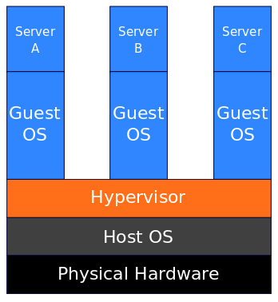
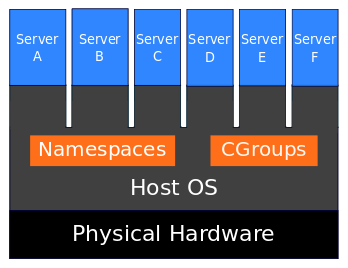

---

Before we start:
- hands up if you write JavaScript for your job
- keep them up if you write server-side applications in Node.js
- (another step?)
- keep them up if you have been known to FTP files onto a server
- keep them up if you have ever live-edited a file on a server in production
- Who's ever used Docker?
- who's ever used kubernetes?

---

- 12-factor app
- history of Docker
- pitfalls of traditional approach
- cattle not pets
- Puppet: how can you be sure that everything on the server has been documented? Scared to apply a patch because a server has been 'up' for so long?
- Docker is not enough
	- the application in a container is only a small part of the picture
	- run a container in production, but with firewalls, networking all manually provisioned - confusing AWS console
	- how can you be sure that the right number of containers are always running?
	- how can you make the best use of resources (CPU, memory)?

---

# me using containers

- first, FTP. All our servers were named after spices: I remember when Turmeric was replaced by Saffron
- Jenkins deployment to server via rsync; common to ssh in; Puppet to manage server config
- played with Vagrant for local development. Docker relies on containerization, while Vagrant utilizes virtualization. Vagrant is a "Virtual Machine manager" . Single tool for provisioning Virtual Machines/Containers from any of the providers. For its virtualisation it can use different providers. Originally the default provider was virtualbox, but it now supports many more, including vmware fusion, Amazon EC2, Google Compute Engine, Rackspace cloud.
	- **Virtualization**: With virtualization, each virtual machine runs its own entire operating system inside a simulated hardware environment provided by a program called hypervisor running on the physical hardware.
	-  https://www.quora.com/What-is-the-difference-between-Docker-and-Vagrant-When-should-you-use-each-one
	- +++ the near-complete separation between the virtual machine(s) and the host enables you to have Linux virtual machines on a Windows host or vice versa.
	- - - - you have to dedicate a static amount of resources (CPU, RAM, storage) to the virtual machines, and the hypervisor will eat up a lot of resources (this is usually referred to as overhead)
	- **Containerisation**
	- Containerization allows multiple applications to run in isolated partitions of a single Linux kernel running directly on the physical hardware. Linux cgroups and namespaces are the underlying Linux kernel technologies used to isolate, secure and manage the containers.
	- 
	- +++ Performance is higher than virtualisation since there is no hypervisor overhead, and you are closer to the bare metal. Also the container simply uses whatever resources it needs, period.
	- - - - Containers use the host machine’s kernel. No funny Windows stuff on a Linux host.
- Cattle, not Pets (coined in 2012)

> In the old way of doing things, we treat our servers like pets, for example Bob the mail server. If Bob goes down, it’s all hands on deck. The CEO can’t get his email and it’s the end of the world. In the new way, servers are numbered, like cattle in a herd. For example, www001 to www100. When one server goes down, it’s taken out back, shot, and replaced on the line.

### Pets
Servers or server pairs that are treated as indispensable or unique systems that can never be down. Typically they are manually built, managed, and “hand fed”. Examples include mainframes, solitary servers, HA loadbalancers/firewalls (active/active or active/passive), database systems designed as master/slave (active/passive), and so on.

> First you give them a name. Then you installed services on that server, and if the server got corrupted or hardware failed you had to repair the computer, possibly rebuild the hard drive, fix corrupted filesystems, I could go on essentially you nursed it back to health. This is referred to as “taking care of a pet”, you take care of it, you update, upgrade, and patch it. Some applications still need this attitude, but many in this decade do not! Now we’ve changed, and we with RESTful APIs can quickly spin up infrastructure, and build from scratch to a working machine in minutes.

### Cattle
Arrays of more than two servers, that are built using automated tools, and are designed for failure, where no one, two, or even three servers are irreplaceable. Typically, during failure events no human intervention is required as the array exhibits attributes of “routing around failures” by restarting failed servers or replicating data through strategies like triple replication or erasure coding. Examples include web server arrays, multi-master datastores such as Cassandra clusters, multiple racks of gear put together in clusters, and just about anything that is load-balanced and multi-master.

> Now with cloud computing we are able to do amazing things. I can easily build a “golden image” from a running application, even build that image from scratch and use it in an autoscaled environment (something Netflix has done for years!). Using tools like Ansible, Puppet, Salt, and Chef, you can quickly build new infrastructure that is known to work. You can even use those tools to build a brand new image which can then be used to create 100 servers just with one command line entry. Instead of names these guys get numbers. All servers are essentially identical to each other. If a server dies, you issue a couple API calls (or not if you are using AWS Autoscaling or similar, as it does it for you if you want it to), and now you have replaced that server in your environment. If a cow is ill/dying you kill it, and get another. That’s where this analogy originates. 

http://cloudscaling.com/blog/cloud-computing/the-history-of-pets-vs-cattle/

In the context of comparing it to Puppet and Chef, it is better to think of Docker as a way to package code into consistent units of work. These units of work can then be deployed to testing, QA and production environments with far greater ease. Puppet, Ansible, Chef, etc. all share a complexity that reflects the difficulty of configuring bare metal and virtual machines.  This means not only launching them, but also modifying the state of their configuration -- often with the release of new software. Because Docker needs to only to express the configuration for a single process, the problem becomes far easier.  The Dockerfile is, thus, not much more than a simple bash script for configuring a process with its dependencies.

---
Joe Beda (one of the founders of Kubernetes):

> The way I think about it: every difference between dev/staging/prod will eventually result in an outage.

https://twitter.com/jbeda/status/921185541487341568

---

[http://localhost:5000/1](http://localhost:5000/1)

^ [http://localhost:5000/1](http://localhost:5000/1)

---

Talk is called "An introduction to Docker and Kubernetes for Node.js developers", but I'm a developer. Rather than a deep dive where you'll learn everything, this is a more personal story of how my relationship with servers has changed over the years.

---

1. FTP code onto a server. Wordpress, etc.
2. I discovered rsync and mounted SFTP drives, so could work 'on the server'
3. First real job: a suite of servers (affectionately named after herbs and spices - Tarragon, Turmeric, Saffron), in a datacentre which we sometimes needed to drive to to install a new rack box
4. Server configuration was managed by Puppet, code was deployed via rsync by Jenkins CI jobs
	- a number of drawbacks (TODO), but the thing which bit us most often, and seemed so hard to solve, was how different dev, ci and production environments were.
	- we ended up with a 'sandbox' environment, hosted in a server room a few meters from our desks, and everyone on the team had a different way of getting code onto the server: 
		- some SSH'd in and used Vim
		- some mounted the drive and worked locally, with hiccoughs
		- some developed complicated 2-way rsync solutions
	- We then migrated to a Vagrant setup, running a full virtual machine with the services we needed, and mounting folders into it from the hosts. Not a bad workflow, but there were loads of compromises: simplified installations of software, everything in the same VM rather than isolated as it would be in prod, all localhost networking, no load balancing. Most worryingly, we could get out of sync between dev, ci and prod extremely easily, and we had no easy way to verify new versions of software.
	- mention live-editing server files in production, and how different that process is with Docker
	- running code on Mac, Windows and Linux

---

So how to improve confidence that the process you run locally in development behaves the same as in production? The first challenge we need to solve is similar to good code practice: isolation, encapsulation, versioning, declarative, standardised, repeatable, verifiable, simplicity for developers, portability

---

quick intro to Docker

---

So what does Docker look like for us JavaScript developers?

---

kubernetes

- how does Docker solve the problems I had in my last job?
	- more confidence in exactly what is running on each server
	- confidences that processes are secure and isolated
	- much easier for devs to spin up a production-like server environment for each app
- although our main application processes are now well described, we still have huge differences between dev, ci, staging and production
	- each individual application component (front-end server, API server, database server, etc.) are now well-described with Docker images, but not how they communicate together
	- production has multiple redundant replicas of each server process, and a loadbalancer running across them. Perhaps also autoscaling
	- production environment will vary depending on the cloud provider: AWS, Google Cloud, etc.
	- local dev setup uses localhost, incorrect ports, different filesystems, etc.
- history of k8s
- concepts (https://www.sitepoint.com/kubernetes-deploy-node-js-docker-app/)
- very complex tool, but quite easy to get started
- create pod from image (explain pod can have multiple containers sharing localhost and filesystem, but with different images!), demo pod running (kubectl describe)
- create service to expose pod on a port (show curl hostname working internally)
- create replicaset (keeps required number of pods alive)
- create deployment (wraps a replicaset, adds scaling, rollout and roll-back) (spin up one pod, scale to two, kill both, watch them recreate)
- create ingress
- All these demos have been on my local machine with Minikube
- IDENTICAL IN PROD
- supported in loads of cloud providers
- for a loadbalancer, we use Nginx Ingress Controller, which means we don't use a provider-specific loadbalancer
- we have autoscaling built in
- lots more to learn:
	- clusters, nodes and nodepools
	- prometheus
	- helm
	- stern
	- GitLab CI

---

Local development will, I hope, be getting much nicer, as Docker have just announced future support for Kubernetes in their free Community Edition, meaning you can run complete k8s setups locally, for free, using your native hypervisor rather than a virtual machine.  

Docker support for Kubernetes

[.footer: [https://www.docker.com/kubernetes](https://www.docker.com/kubernetes)]

---

https://www.sitepoint.com/kubernetes-deploy-node-js-docker-app/local
